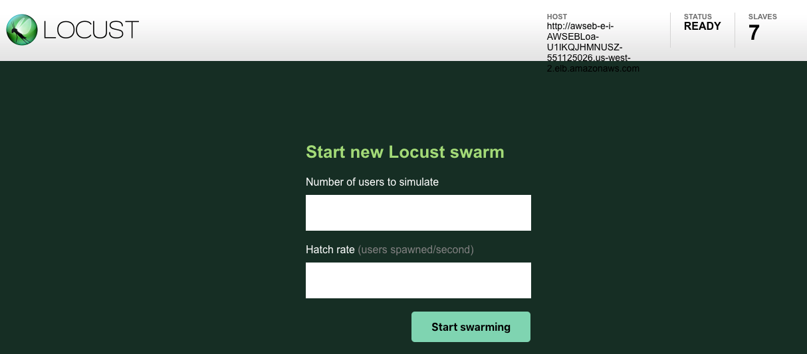

# Review the existing solution and take a performance baseline

1. **Review the existing solution and take a performance baseline**
2. [Review the configuration of CloudFront, and adjust load tests to use it](2-cloudfront.md)
3. [Review ElastiCache and the code changes required to use it, take a new set of load tests](3-elasticache.md)
4. [Review configuration of Serverless API components, incorporate it in to the load tests](4-serverless.md)
5. [Conclusion](conclusion.md)

Begin by signing in to your AWS account and browsing to CloudFormation. You will see a template
called "PlayerStartTemplate" that has been deployed. Go in to it and review its outputs, you will
see a number of important URLs here:

The URLs are:

* ApiGatewayUrl - The URL of the API Gateway that provides a serverless API layer
* CloudFrontUrl - The URL of the CloudFront distribution used to distribute the site
* LoadBalancerUrl - The URL of the main load balancer to browse the web app
* LoadTestUrl - The URL of the load tester app
* ServerlessDashboard - The URL to the dashboard that monitors the performance of the serverless API
* WebAppDashboard - The URL to the dashboard that monitors performance of the main web app
* WebAppCacheDashboard - The URL to the dashboard that monitors performance of the main web app with caching enabled

Copy the LoadBalancerUrl value and open it in a new browser tab. This is the beginning web app that
we will be using throughout the session.

## The web application

The web app is written in NodeJS and uses a database in MariaDB to display a list of products found
in our sample dataset, and the number of reviews that each product has. The code for this site is
included in this repository if you wish to review it in full.

### Reverse Proxy configuration

The web application is configured in [AWS Elastic Beanstalk](https://aws.amazon.com/elasticbeanstalk/)
which allows for platforms to make use of an [NginX reverse proxy](https://docs.aws.amazon.com/elasticbeanstalk/latest/dg/java-se-nginx.html)
on each server. In the case of this application is has been configured to retrieve a number of
the static files in use for the solution and send them out before they are requested by the
NodeJS server, which improves the overall responsiveness of the app.

### Autoscaling Group configuration

In anticipation of a large amount of load, the developers of this site configured auto-scaling
rules in Elastic Beanstalk so that additional web servers would appear when needed. The site
keeps a minimum of 2 servers around but can scale up to 4 based on the CPU load on each server.

### Data loaded on the web page

The important part to notice here is that the data that is shown on the screen here is loaded
dynamically through an API call to the "/data" url on the server. This query typically takes 1-2
seconds to complete and causes some CPU load to occur on the database server. The query is shown
below:

    select titles.product_title, titles.product_id, pids.total_reviews from auto titles
    right join (select product_id, count(product_id) as total_reviews from auto
    group by product_id order by total_reviews DESC limit 25)
    pids on titles.product_id = pids.product_id group by product_id, product_title
    order by pids.total_reviews DESC;

This query includes joins and aggregating values from a large dataset, which is the cause of the
CPU load on the database server when the query runs.

## Performing an initial load test

Return to CloudFormation in your console and look at the URLs described earlier. Open the URL for
the LoadTestUrl in a new tab. Here you will see [Locust](http://locust.io) has already been configured
with a number of tests to run against our test site. The code for these tests are in the src/loadtest
path of this repository for further review. The tests are designed to simulate users calling traffic to
the site, making more calls to /index.html and /data and fewer to the image and JavaScript resources
(as these are more likely to be cached by local proxy endpoints elsewhere after they return HTTP 302
responses).

To begin, enter 50 users with a hatch rate of 5. This will tell locust to simulate a total of 50
users browsing the site at the same time, but to ramp it up at 5 users per second. This means that
10 seconds after the load test starts it will be at its maximum load. Leave this test running for a moment while we observe how the site is performining in the back end.

Return to CloudFormation in your console and open the URL for the WebAppDashboard in a new tab. This
dashboard has been configured to monitor your web servers and database server. The dashbboard will
auto-refresh every 10 seconds, allowing you to watch the latest data as it flows in to CloudWatch.

While this load test is running you can see the following metrics:

* Load balancer performance, showing how many hosts are behind the load balancer, the latency of
  requests passing through it, and the number of requests it is handling each minute
* EC2 Performance, showing the CPU and network output of the actual web servers behind the load
  balancer
* Database performance, showing the number of connections that are open to the DB as well as its
  CPU performance
* Database read performance, showing us the IOPS used for reads as well as network traffic in and
  out of the database server

After the load test has been running for a minute or two you should be able to see that the database
CPU hits 100% as soon as our test begins. The Web servers are relatively static on CPU, as is the
IO on the database.

Return to Locust and observe the stats of your test - the average response time on the /data URL will
be dramatically higher than the others (usually around 6 seconds), meaning that when the site is under
load the performance for end users drops (remember, we saw it load in 1-2 seconds before the test
began).

Click on the "Edit" button at the top of the screen in Locust and change the test numbers to 100 users
and a hatch rate of 10. This will double the traffic to our site, take a moment to observe the changes
to the response time of the URLs locust is testing, you should see another dramatic increase in the
load time of the /data endpoint.

Now change the number of users in the load test to 500 (hatch rate 50). This should be enough load to
start seeing the failures number in locust start to go up, as now the /data url is no longer able to
respond quick enough, which now breaks the application for our users.

Press the stop button at the top of the screen for locust to end the load test. It's time to start
making some changes to improve the availability of the site.

[Go to next section](2-cloudfront.md)
