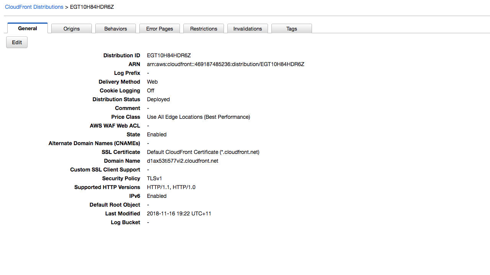
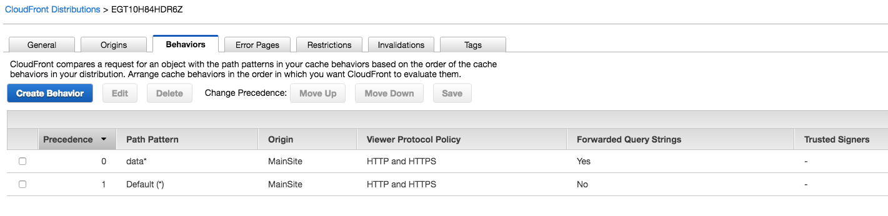
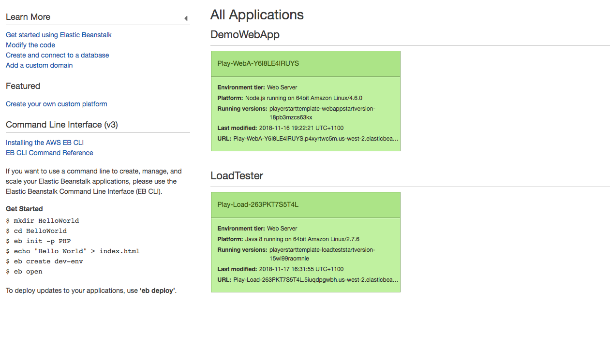
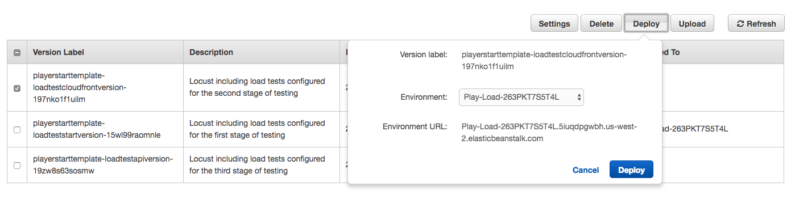

# Review the configuration of CloudFront, and adjust load tests to use it

1. [Review the existing solution and take a performance baseline](1-start.md)
2. **Review the configuration of CloudFront, and adjust load tests to use it**
3. [Review ElastiCache and the code changes required to use it, take a new set of load tests](3-elasticache.md)
4. [Review configuration of Serverless API components, incorporate it in to the load tests](4-serverless.md)
5. [Conclusion](conclusion.md)

Now that we have seen that it only takes 500 people coming to our site to break it, lets start
looking at what can be done to improve it's availability. The first service we are going to implement
here is [Amazon CloudFront](https://aws.amazon.com/cloudfront/). CloudFront is a content delivery
network, which means that users can access the CDN from a location that is closest to them (AWS
has more than 100 points of presence worldwide) and that content can be cached in those locations to
improve the time it takes to respond to certain requests.

## Look at CloudFronts configuration

A CloudFront distribution has been configured for your site as part of the initial deployment, so
open the AWS console and browse to CloudFront to review it's configuration. You should see a single
distribution that has been deployed from our template. Select it to see it's configuration.

In cloudfront you will see the following configuration items:

* Origins - this is where your content comes from
* Behaviors - this is where you can set different caching rules for parts of your site
* Error pages - here you can set the error pages that users will see, for example you could set a
  custom 404 page, or a custom page for when the site is too busy to respond like in our previous load
  test
* Restrictions - You can restrict your site to only be available to certain countries
* Invalidations - here you can invalidate specific URL patterns in your cache, forcing them to be
  reloaded from the source
* Tags - any custom tags you wish to include in your distribution to manage things in the AWS console
  better

Open the behaviors tab and note that there are two behaviors that have been configured for you.

* data* - this pattern will match calls to the /data URL
* Default(*) - this is a catch all rule that is called if no rules above it in the list are matched

Select the data rule and choose "Edit". Here you will see the configuration of how CloudFront will
treat the calls made to the /data URL. Review all the settings here, but pay particular attention to
the TTL properties:

* Minimum TTL - The minimum amount of time, in seconds, that you want objects to stay in
  CloudFront caches before CloudFront forwards another request to your origin to determine
  whether the object has been updated. Minimum TTL interacts with HTTP headers such as
  Cache-Control max-age, Cache-Control s-maxage, and Expires and with Default TTL and
  Maximum TTL.
* Maximum TTL - The maximum amount of time, in seconds, that you want objects to stay in
  CloudFront caches before CloudFront forwards another request to your origin to determine
  whether the object has been updated. The value that you specify applies only when your
  origin adds HTTP headers such as Cache-Control max-age, Cache-Control s-maxage, and
  Expires to objects.
* Default TTL - The default amount of time, in seconds, that you want objects to stay in
  CloudFront caches before CloudFront forwards another request to your origin to determine
  whether the object has been updated. The value that you specify applies only when your origin
  does not add HTTP headers such as Cache-Control max-age, Cache-Control s-maxage, and Expires
  to objects.

It's important to understand how these values work in tandem with the cache headers that your web
application sends when configuring them. Note the values that are shown on the data URL at the moment.
Note that the new configuration tells CloudFront it is OK to cache objects for 1 second for the /data
URL. This means that the users of our site will see data that is potentially, at most, 1
second old. In most cases, this won't cause issues and it can help us alleviate some of the issues
with our sites performance.

Browse back to the behaviors tab and view the default cache behavior. It caches objects for 600
seconds (10 minutes), meaning that CloudFront should only make requests of our main app for all other
URLs once every 10 minutes for each cache location. This will dramatically lower the number of requests
that our web application has to respond to.

## The next load test

Next we need to tell Locust to use a different set of load tests against our site, specifically
to change the URL it browses to, setting it to the CloudFront URL rather than the load balancer
directly. To do this, browse to Elastic Beanstalk in the AWS console, and select the heading that
says "Load Tester" (not the green box under it).

Select "Application Versions" on the left of the screen, then choose the checkbox next to the row
that shows "cloudfront.zip" in it. Click "Deploy" above, and then the "Deploy" button again to
tell Elastic Beanstalk to deploy the new code to your load test server. It will show you a
notification with a link to the "events" page, go there and wait for it to say that the deployment
is complete (this should only take a minute or two).

Return to your load test application and refresh the page. You should now see that your CloudFront
URL is at the top of the page, and we can now restart the test. Being with the 500 users (hatch rate
of 50) that broke the site before hand.

Observe this test running for a minute or two, noticing now that we aren't seeing failures like we
were previously and now our web app can comfortably handle 500 users coming to it. The /data URL will
still be taking some time to respond, but the site doesn't fail to handle the load.

Return to your CloudWatch metrics dashboard from earlier and observe the impact of adding CloudFront
has had on the site at this point. I can see that my database is still running at 100% (it is still
getting that query once every second) but other than that the stats should be largely similar to the
previous test, but the site is still responding and much quicker than it was previously.

As CloudFront is now handling the majority of the requests we can dial the test up dramatically more
and still see a similar result in terms of the performance of the servers we are operating. This is
one of the great benefits of CloudFront, and we will only pay for what we use in terms of traffic that
goes through CloudFront.

As a next step though we should look at really fixing how that database is queried, as in a production
workload other types of queries would be happening also, so having it run at 100% just to serve read
traffic isn't a long term solution.

Stop the load test and we will continue by adding database caching.

[Go to next section](3-elasticache.md)
