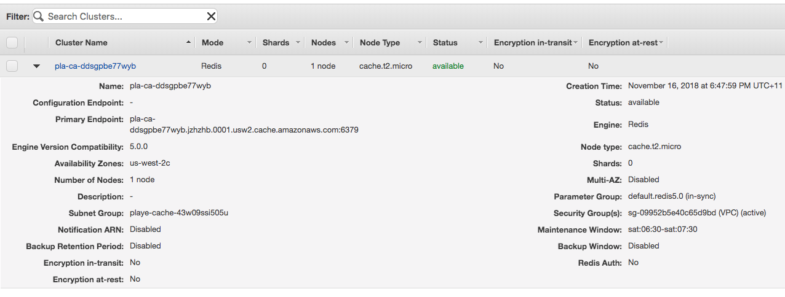

# Review ElastiCache and the code changes required to use it, take a new set of load tests

1. [Review the existing solution and take a performance baseline](1-start.md)
2. [Review the configuration of CloudFront, and adjust load tests to use it](2-cloudfront.md)
3. **Review ElastiCache and the code changes required to use it, take a new set of load tests**
4. [Review configuration of Serverless API components, incorporate it in to the load tests](4-serverless.md)
5. [Conclusion](conclusion.md)

Caching the output of database queries with the use of an in-memory cache is a popular pattern in
web applications as a mechanism to improve performance. In this next step we will enable Redis
through the use of the [Amazon ElastiCache service](https://aws.amazon.com/elasticache/). ElastiCache
provides a managed cache server, so that we don't need to spend time patching it and keeping it
available, and we can use it the same as any other Redis server. ElastiCache also offers a MemcahceD
option, but in this session we will use Redis.

## Reviewing the ElastiCache configuration

Open the AWS console and browse to the ElastiCache service. Select "Redis" from the left and you will
see the pre-configured Redis cache that was deployed along with the initial solution.

Here you can see that we are running a single Redis node that is in a single AZ - typically you would
run one in each availability zone that your app was running in. This screen shows us what the primary
endpoint for the Redis node is though, which will be used in our code.

## Updating the code to use ElastiCache

When we implemented CloudFront there was no change to our code, we could just put the service in front
of our web site and that was it. Now we need to make a small change to our code that queries the
database, telling it to check the cache first and if there is nothing in the cache, or if the cache has
expired, to then go to the database as a fallback. Below is a sample of the code from 
src/web/start/routes/data.js that does the initial query:

    pool.getConnection(function (err, connection) {
        if (err) {
            console.log('Error getting mysql pool connection: ' + err);
            if (connection) {
                connection.release();
            }
            throw err;
        }

        connection.query("select titles.product_title, titles.product_id, pids.total_reviews from auto titles right join (select product_id, count(product_id) as total_reviews from auto group by product_id order by total_reviews DESC limit 25) pids on titles.product_id = pids.product_id group by product_id, product_title order by pids.total_reviews DESC;", function (err2, result, fields) {
            if (err2) {
                console.log('Error executing query: ' + err2);
            }
            res.header('Cache-Control', 'private, no-cache, no-store, must-revalidate');
            res.header('Expires', '-1');
            res.header('Pragma', 'no-cache');
            res.json(result);
            connection.release();
        });
    });

We are using a SQL connection pool here, which is why you will see 15 connection per server when you
look at the CloudWatch metrics. A connection is acquired from the pool and then the query is issued. In
This example we are also adding headers to the response that tell clients to not cache this data - in
practice you could use these to configure how CloudFront would treat your response, they are just
configured like this here to demonstrate how additional requests hitting the server are handled.

Now we need to add code to this that will leverage Redis.

    var cacheKey = 'TestData';
    client.get(cacheKey, function(err4, result) {
        if (result) {
            if (err4) { console.log('Redis error: ' + err4); }
            res.header('Cache-Control', 'private, no-cache, no-store, must-revalidate');
            res.header('Expires', '-1');
            res.header('Pragma', 'no-cache');
            res.send(result);
        } else {
            pool.getConnection(function (err, connection) {
                if (err) {
                    console.log('Error getting mysql pool connection: ' + err);
                    if (connection) {
                        connection.release();
                    }
                    throw err;
                }

                connection.query("select titles.product_title, titles.product_id, pids.total_reviews from auto titles right join (select product_id, count(product_id) as total_reviews from auto group by product_id order by total_reviews DESC limit 25) pids on titles.product_id = pids.product_id group by product_id, product_title order by pids.total_reviews DESC;", function (err2, result, fields) {
                    if (err2) {
                        console.log('Error executing query: ' + err2);
                    }

                    client.set(cacheKey, JSON.stringify(result), 'EX', 60, redis.print);
                    res.header('Cache-Control', 'private, no-cache, no-store, must-revalidate');
                    res.header('Expires', '-1');
                    res.header('Pragma', 'no-cache');
                    res.json(result);
                    connection.release();
                });
            });
        }
    });

There are a couple of things to note here - firstly we are testing to see if we can retrieve data
from Redis using our CacheKey. If we get a result, we simply send that and that is the end of that. If
there is no response though (which will happen if the cache is empty or expired) then we go back in to
our normal code. This time though, before we send the response we make a call to client.set to set the
cache value. Here we are storing the response as a string to retrieve and return - Redis is capable of
many more complex mechanisms for caching, this is a simple example.

Also note that in the call to client.set we are caching the value here for 60 seconds. Now CloudFront
could be used here to cache the response that goes to the client, but by caching it in memory near
your application servers you have the option to manipulate or otherwise inspect the response before it
is sent to CloudFront, which opens up more doors for application specific logic to act on a response.

## Deploying the updated code to the web application

In much the same way as we deployed the updated load test to locust, we will now use Elastic Beanstalk
to deploy an updated code package to our main web application. Browse to Elastic Beanstalk again and
this time select the heading "DemoWebApp" (not the green box, the heading). Choose "Application
versions" on the left. Select the row that contains "cache.zip", and then click deploy and deploy again
to start the deployment. Follow the link to the events page to ensure that this completes.

Click the link at the top of the page to open your web app from the load balancer URL again. Note that
the first time it loads, the data still takes a second or two to load. Refresh the page though, the
next load should happen faster. This is in response to the cache returning the data, not the database.

Return to CloudFormation and open the URL for WebAppCachedDashboard - this is the same dashboard that
we were looking at previously, however the database IO figures have been replaced with Redis stats.
Now we are monitoring the cache hits/misses as well as the CPU performance of the cache node.

Spend a few moments observing the performance statistics here as well as back in locust. You'll notice
now we are sustaining a much larger load while having the /data URL respond in just as quick of a time
as the rest of the sites contents.

To really test the new capabilities, reset locust to target 10,000 users (at a hatch rate of 500), and
observe the dashboard statistics that you see.

For the last improvement in this session, we will review how a serverless API model can help provide
a platform for incremental future improvements, as well as giving us finer control over how we use
caching for our data endpoint.

[Go to next section](4-serverless.md)
