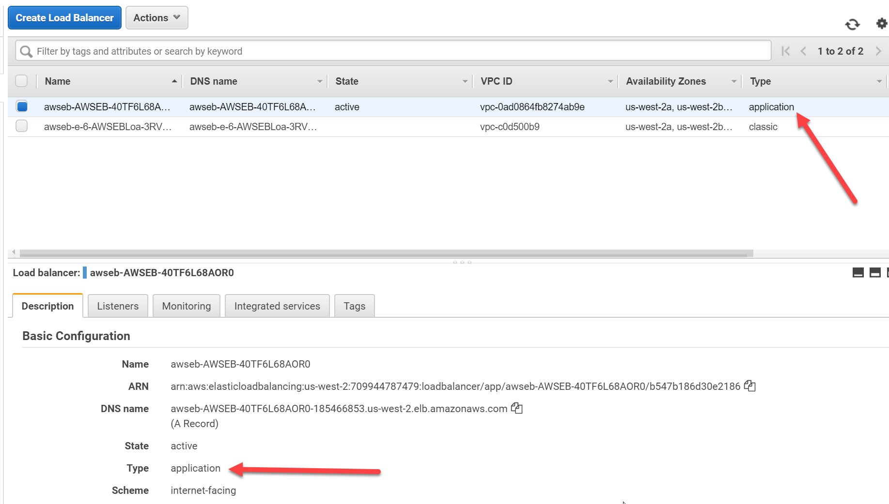

# Review configuration of Serverless API components, incorporate it in to the load tests

1. [Review the existing solution and take a performance baseline](1-start.md)
2. [Review the configuration of CloudFront, and adjust load tests to use it](2-cloudfront.md)
3. [Review ElastiCache and the code changes required to use it, take a new set of load tests](3-elasticache.md)
4. **Review configuration of Serverless API components, incorporate it in to the load tests**
5. [Conclusion](conclusion.md)

Serverless APIs refer to the use of AWS services to create a web based service where the owner of
the service doesn't need to maintain any servers at any point in the solution. There are three
key services we are going to use to demonstrate this concept as part of our app today:

1. [Application Load Balancer](https://aws.amazon.com/elasticloadbalancing/) for managing the front end of our API
2. [Lambda](https://aws.amazon.com/lambda/) to execute the code that responds to the API calls
3. [DynamoDB](https://aws.amazon.com/dynamodb/) to store the data that lambda will query

The premise of this solution is that the Application Load Balancer will direct calls to the /data endpoint
to the lambda function instead of the going to the web server. This is a common approach that is used
when migrating a legacy monolith application to a microservices model. You can move method by method to
lambda funciton or containers while leaving the rest of the application as-is. Your users are also going
to continue interacting with the same endpoints, the change is transparent to them. When our
API gets called, we will run a lambda function rather than having a traditional web server available
to respond to it. Lambda lets you run your code without having to manage a server, and you only
pay for the time your code is running, as opposed to paying for the web server even when no load
is present. Then we we will use DynamoDB as a NoSQL data store for our API - again, this is a
managed service so you don't need to manage servers here, just put data in and get it back out.

## Review DynamoDB

In the AWS console go to the DynamoDB page from the services menu. Select "tables" from the left,
and then choose "LoadTestDataStore". Here you see the details of our data table.

Select the items tab and you can see the data you will be working with. It is based on the results
of the query that we have been running throughout this session. As DynamoDB is a NoSQL based data
store it is not able to perform complex queries like the one we were running. Instead, a popular
design pattern that can be used here is to use DynamoDB as a cache of the previously generated
results that can be quickly scanned and retrieved. We used Redis in much the same way previously,
but DynamoDB can be a simpler option as there is only a single service to consider compared to
having both a database and a caching layer.

Select the capacity tab. Here you see how Dynamo scales - through Read and Write units. You pay
for the amount of read and write throughput that your table needs, and this can be configured
to autoscale.

## Review Lambda

In the AWS console go to Lambda in the services menu. Select the function that has "QueryFunction"
in its name.

Here we can see a number of things. At the top we can see that our function can be triggered by API
Gateway, and that is has permission to call CloudWatch logs and DynamoDB. You can configure
fine-grained access controls for lambda through IAM policies to make sure your code isn't overly
privileged.

Beneath this you can see that actual code we are running. In this case we are continuing to use
NodeJS and we are using the AWS SDK to make a call to DynamoDB to return the results back. Promises
and the await statement are used here to ensure the query runs before lambda considers the function
complete.

## Configure the load balancer

Next we need to configure our load balancer to send the requests for the /data endpoint to our lambda
function. Begin by heading to the EC2 page in the AWS console and selecting "Target Groups" (under the
load balancing heading). The first step here involves creating a new target group for the lambda function.
Select "Create Target Group" and enter the required details. Give it a name, choose "Lambda function" as the
target type, and then choose the function with "QueryFunction" from the drop down list as the function. Leave
the health check box unchecked here as well (but look in to this for any production functions).

Now that we have a target group, we can tell the load balancer to send the required requests to that function.
Go to the "Load Balancers" link on the left menu (again under the load balancing heading). You should see
two load balancers here, both created by Elastic Beanstalk. One is a classic load balancer, and the other is an
application load balancer. The classic one is used by our Locust load test app, and the application one is the
load balancer that our main application uses. The easiest way to spot the difference here is to look at the "type"
property on each on. 

Select the application load balancer, then choose the "Listeners" tab. Here we can edit the rules about how
the traffic will be routed once it hits the load balancer. Select the "View/edit rules" link so we can add the
new target group to the list.

In the rules editor we can now choose the "add" button (the plus icon at the top), then click "insert rule". The
new rule will use a path based rule, sending requests to /data to our target group. Select the appropriate options
to forward these requests then click the save button.

## The last load test

There is no need to redeploy any code here - as we mentioned earlier, as long as your lambda function
returns objects with the same structure, the change here will be transparent to your end users. This means
we can launch right in to running our load test. Head back to Locust and start the load test at 10,000 users.

While this load test runs, return to CloudFormation and browse to the URL for the ServerlessDashboard.
Here we are tracking the ALB, Lambda and DynamoDB use. Allow the test to run for a few minutes
and observe the response times and throughput of this model.

Also consider that CloudFront is still caching that data endpoint at the same rate of 1 second as per the
previous configuration. This means I've still got the ability to control caching of my serverless endpoint
the same as any other endpoint. 

To finish with, set locust to swarm with 30,000 users (at a hatch rate of 1000) and observe the way
the application behaves. It should now be running just short of 3000 requests per second, and still
maintaining acceptable response times to all URLs.

[Go to next section](5-conclusion.md)
