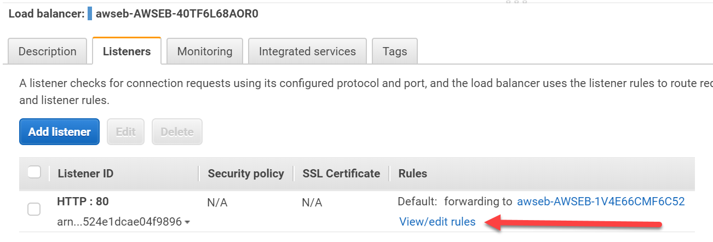

# Review configuration of Serverless API components, incorporate it in to the load tests

1. [Review the existing solution and take a performance baseline](1-start.md)
2. [Review the configuration of CloudFront, and adjust load tests to use it](2-cloudfront.md)
3. [Review ElastiCache and the code changes required to use it, take a new set of load tests](3-elasticache.md)
4. **Review configuration of Serverless API components, incorporate it in to the load tests**
5. [Conclusion](conclusion.md)

Serverless APIs refer to the use of AWS services to create a web based service where the owner of
the service doesn't need to maintain any servers at any point in the solution. There are three
key services we are going to use to demonstrate this concept as part of our app today:

1. [API Gateway](https://aws.amazon.com/api-gateway/) for managing the front end of our API
2. [Lambda](https://aws.amazon.com/lambda/) to execute the code that responds to the API calls
3. [DynamoDB](https://aws.amazon.com/dynamodb/) to store the data that lambda will query

The premise of this solution is that API gateway will provide the public point of contact for our
API. It leverages CloudFront behind the scenes for it's caching, but it also allows you to configure
cache settings that are not only specific to a URL, but also to specific HTTP verbs also. When our
API gets called, we will run a lambda function rather than having a traditional web server available
to respond to it. Lambda lets you run your code without having to manage a server, and you only
pay for the time your code is running, as opposed to paying for the web server even when no load
is present. Then we we will use DynamoDB as a NoSQL data store for our API - again, this is a
managed service so you don't need to manage servers here, just put data in and get it back out.

## Review DynamoDB

In the AWS console go to the DynamoDB page from the services menu. Select "tables" from the left,
and then choose "LoadTestDataStore". Here you see the details of our data table.

Select the items tab and you can see the data you will be working with. It is based on the results
of the query that we have been running throughout this session. As DynamoDB is a NoSQL based data
store it is not able to perform complex queries like the one we were running. Instead, a popular
design pattern that can be used here is to use DynamoDB as a cache of the previously generated
results that can be quickly scanned and retrieved. We used Redis in much the same way previously,
but DynamoDB can be a simpler option as there is only a single service to consider compared to
having both a database and a caching layer.

Select the capacity tab. Here you see how Dynamo scales - through Read and Write units. You pay
for the amount of read and write throughput that your table needs, and this can be configured
to autoscale.

## Review Lambda

In the AWS console go to Lambda in the services menu. Select the function that has "QueryFunction"
in its name.

Here we can see a number of things. At the top we can see that our function can be triggered by API
Gateway, and that is has permission to call CloudWatch logs and DynamoDB. You can configure
fine-grained access controls for lambda through IAM policies to make sure your code isn't overly
privileged.

Beneath this you can see that actual code we are running. In this case we are continuing to use
NodeJS and we are using the AWS SDK to make a call to DynamoDB to return the results back. Promises
and the await statement are used here to ensure the query runs before lambda considers the function
complete.

## Review API Gateway

Now in the AWS Console go to the "API Gateway" service page. You'll see one API called
"ServerlessAPIExample". Select this and you will see the management console for the API.

Here you can see our API just uses the root URL ('/') and has two methods based on HTTP verbs - GET
and OPTIONS. We have configured the OPTIONS call to allows CORS based calls to this API (review the
code for this in the main cloudformation template). The GET method has been configured to point to
the lambda function we just configured. Click on the GET method to see it's configuration.

Select "Stages" on the left and choose "latest". Stages are a mechanism to allow different versions
or configurations of your API to exist at the same time. For example you could have a stage called
'latest' for anyone who wants to just use the latest API version you have, but you could have stages
for v1.0 or v2.0 or other legacy versions of your API so that applications that depend on them can
call out to them specifically.

Stages are where we can configure caching and other settings. Check the box to enable API caching,
set the cache size to 0.5GB, set the TTL to 60 seconds and disable the per-key cache invalidation.
These are settings you can explore when you wish to cache results per authenticated user (which
opens up many more possibilities for how caching could improve the user experience of your site).
Scroll down and click save to enable the cache.

## The last load test

Before we can run our last load test we need to deploy new code to both the main web application
and to the load testing application. Do this through elastic beanstalk as you have done previously
for each of these, selecting the version that uses "serverless_api.zip" in both applications.

The change to the load test is simple, it directs calls that would normally go to the /data endpoint
to go directly to API Gateway. The update in the main web application changes the code so that
the JavaScript file that is sent to the client tells it to query API Gateway instead of /data.
There are also some minor tweaks to how it renders the result, as the JSON object returned from
DynamoDB is slightly different.

Once your application has been deployed to both the load tester and the main web application, head
back to Locust and start the load test at 10,000 users. In locust you will now see /latest
instead of /data.

While this load test runs, return to CloudFormation and browse to the URL for the ServerlessDashboard.
Here we are tracking API Gateway, Lambda and DynamoDB use. Allow the test to run for a few minutes
and observe the response times and throughput of this model.

Also consider that API Gateway gives you a great model to leverage when migrating into a serverless
API model. API Gateway can call Lambda for specific HTTP methods that you have configured and are
ready to be serverless, but it can also forward other methods directly to your web servers for
legacy code that hasn't moved in to the serverless model yet. You can then start being far more
specific with your cache settings than you could with just CloudFront on its own.

To finish with, set locust to swarm with 20,000 users (at a hatch rate of 1000) and observe the way
the application behaves. It should now be running just short of 2000 requests per second, and still
maintaining acceptable response times to all URLs.

[Go to next section](5-conclusion.md)
